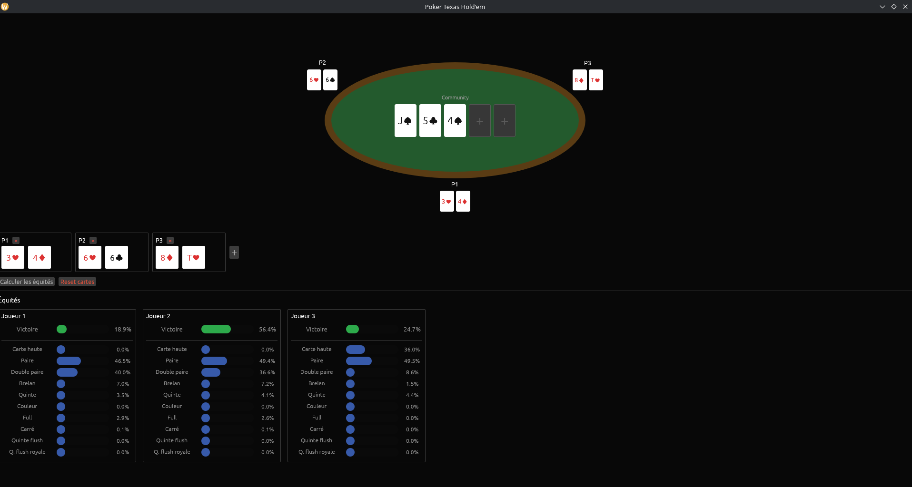
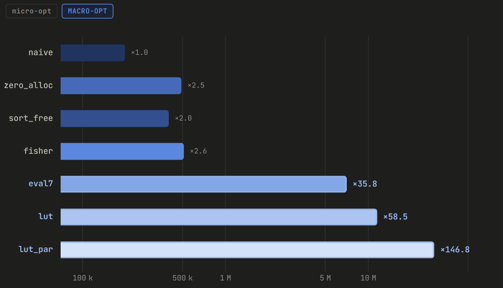
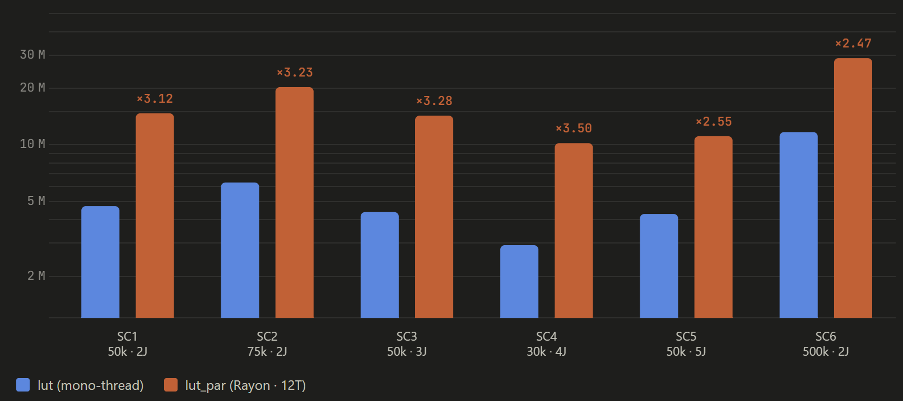

# Rapport d'Audit de Performance — Poker Monte Carlo

> Moteur Monte Carlo Texas Hold'em en Rust — **×147 de gain** sur la baseline naïve via 6 optimisations incrémentales (zero-alloc, eval7, LUT, Rayon).
>
> [https://github.com/EAnathos/poker](https://github.com/EAnathos/poker)

## 1. Présentation du projet

Ce projet implémente un **moteur de calcul de probabilités Monte Carlo** pour le Texas Hold'em en Rust. Étant donné un ensemble de mains et un board partiel, le moteur estime l'équité de chaque joueur par simulation répétée (50 000 à 500 000 itérations selon le scénario). Rust a été choisi dans une optique de découverte : le langage était nouveau, et ce projet, à la croisée des simulations haute fréquence, de la gestion mémoire fine et d'une interface graphique, correspondait aux thématiques du cours sur la performance système.

## 2. Environnement & Métrologie

### 2.1 Bancs d'essai

**Setup A (référence)**

| Composant | Détail |
|-----------|--------|
| CPU | AMD Ryzen 5 5600H — 6C / 12T |
| Cache | L1 32 KiB/cœur · L2 512 KiB/cœur · L3 16 MiB partagé |
| RAM | 16 GiB DDR4-3200 |
| OS / Rust | Arch Linux kernel 7.1.11 · rustc 1.98.1 |

Des benchmarks complémentaires ont été réalisés sur Setup B (AMD Ryzen 7 7735U, Windows 11), documentant l'impact de NT Heap et du scheduler Windows. → [`docs/benchmarks-setup-b.md`](docs/benchmarks-setup-b.md)

### 2.2 Outils de mesure

| Outil | Usage |
|-------|-------|
| **Hyperfine** | Mesure statistique de durée (100 runs, warmup 10) |
| **Samply** | Flamegraph interactif → Firefox Profiler |
| **perf** | Compteurs matériels bas niveau (cache-misses, cycles) |
| **just** | Exécuteur de recettes — [`docs/commandes.md`](docs/commandes.md) |

**Baseline Setup A — `naive` SC6 (500 000 itérations) :** moyenne 2,497 s, σ = 14 ms.

## 3. Scénarios de Benchmark

Six scénarios couvrent quatre axes : nombre de joueurs (2–4), stade de jeu (flop/turn), présence de joueur inconnu, connectivité du board. Le volume d'itérations est calibré pour 800 ms–1,8 s sur la baseline naive (sauf SC6, dédié à la haute précision).

| ID | Scénario | Joueurs | Board | Itérations | Erreur MC |
|----|----------|---------|-------|------------|-----------|
| SC1 | AA vs KK vs QJs | 3 | Flop | 50 000 | ±0,45 % |
| SC2 | AhKh vs 9c9d vs JcTc | 3 | Turn | 75 000 | ±0,37 % |
| SC3 | 7s6s vs AdKd vs QcQh | 3 | Flop | 50 000 | ±0,45 % |
| SC4 | As5s vs KdKc vs QhJh vs ??? | 4 | Flop | 30 000 | ±0,58 % |
| SC5 | Ah5h vs JdJc vs 7c6c | 3 | Flop | 50 000 | ±0,45 % |
| SC6 | AhKh vs QsQd *(haute précision)* | 2 | Flop | 500 000 | ±0,14 % |

SC6 sert de référence de validation et d'amplificateur d'optimisation : son volume élevé rend visibles des gains noyés dans le bruit à 50 000 iters. → Descriptions détaillées des scénarios : [`docs/details-optimisations.md`](docs/details-optimisations.md#scénarios)

## 4. Optimisations

### 4.1 ZeroAllocEvaluator — Élimination des allocations heap

**Diagnostic.** `naive` effectue ≈ 11 M allocations heap par run SC6 (87 % dans `evaluate_five`, appelée 21×/itération via les C(7,5) combos).

**Hypothèse.** Remplacer `Vec` + `HandValue { tiebreak: Vec<u8> }` par des tableaux stack et un `u32` encodé (bits 23:20 = catégorie, bits 19:0 = tiebreaks) supprime la pression allocateur → gain ×2–3.

**Résultat SC6.** 196 900 → 461 700 iters/s — **×2,31**. σ réduit de 17 ms à 11 ms (élimination des pics de latence allocateur).

**Analyse.** Confirmé. Le profil révèle que les deux `sort_unstable_by` internes représentent ~30 % du runtime. La section suivante montre que ce coût est mal interprétable : sur n = 5 éléments en L1, l'insertion sort est quasi-gratuit. → Profil samply complet : [`docs/details-optimisations.md`](docs/details-optimisations.md#41-zeroalloc)

---

### 4.2 SortFreeEvaluator — Suppression des tris (invalidée)

**Hypothèse.** Remplacer les deux `sort_unstable_by` d'`eval5` par un scan freq-table (quinte) et des buckets typés (groupes) → Amdahl théorique ×1,43.

**Résultat SC6.** 461 700 → 399 000 iters/s — **régression ×0,86**.

**Analyse.** L'insertion sort sur 5 octets (L1, ~12 comparaisons inlinées par LLVM) est plus rapide que le remplacement proposé, qui ajoute ~17 opérations. Enseignement clé : le flamegraph montre où le temps est dépensé, pas pourquoi. `eval5` concentrait 50 % du runtime parce qu'elle était appelée 21× par itération — le vrai levier n'était pas son implémentation mais sa fréquence d'appel.

---

### 4.3 FisherEvaluator — Partial Fisher-Yates + Lemire

**Hypothèse.** Remplacer le shuffle complet O(|deck|) par partial Fisher-Yates O(n_needed) + Lemire range reduction (multiplication 128-bit au lieu de division entière) → Amdahl ×1,05.

**Résultat SC6.** 461 700 → 508 800 iters/s — **×1,10**. Gain légèrement supérieur car la suppression de ~1 M de divisions entières à 500k iters est significative en absolu.

**Analyse.** Confirmé. Le shuffle ne dépasse pas ~5 % du runtime : ce levier est plafonné. → Résultats SC1–SC5 : [`docs/details-optimisations.md`](docs/details-optimisations.md#43-fisher)

### 4.4 Eval7Evaluator — Évaluation directe 7 cartes

**Diagnostic.** `best7` appelle `eval5` 21× par joueur par itération (C(7,5) combos). Sur SC6 (500k iters, 2 joueurs) : ≈ 2,52 milliards d'instructions pour `best7` seul.

**Hypothèse.** Une passe directe sur 7 cartes (freq-table + suit-table → catégorie sans énumération) réduit le nombre d'évaluations de 21 à 1 → gain ×10–15.

**Résultat SC6.** 508 800 → 7 042 300 iters/s — **×13,84 vs fisher**, **×35,8 vs naive**.

**Analyse.** Gain dominant de la chaîne. Réduction i-cache (1 appel vs 21) et branch predictor (patterns stables vs 21 sous-ensembles différents) expliquent le ×14. Les micro-optimisations 4.1–4.3 (×2,6 cumulé) deviennent marginales. → Résultats SC1–SC5 : [`docs/details-optimisations.md`](docs/details-optimisations.md#44-eval7)

---

### 4.5 LutEvaluator — Tables pré-calculées + seuil adaptatif

**Hypothèse.** Précalculer toutes les valeurs de mains dans deux tables indexées (flush 32 Ko → L1 ; non-flush 1,5 Mo → L3 après warmup) réduit l'évaluation à ~25 instr. + 1–2 accès cache → gain ×1,5–2 à ≥ 200 000 itérations.

**Implémentation.** Seuil unique résolu avant la boucle (`lut_opt: Option<&'static LutData>`), LLVM hisse la branche hors du hot path. En dessous du seuil, `eval7_inline` s'exécute sans initialisation des tables.

**Résultat SC6.** 7 042 300 → 11 520 700 iters/s — **×1,64**. SC1–SC5 (< 200k iters) : ~×1,0. RAM : +1,6 Mo sur SC6, 0 Mo supplémentaire sur SC1–SC5.

**Analyse.** Gain inférieur à la prédiction : la chaîne de 13 multiply-add dans `freq_key` (dépendance séquentielle → ~39 cycles de latence) compense une partie du gain sur l'accès L3.

---

### 4.6 LutParEvaluator — Parallélisation via Rayon

**Hypothèse.** La simulation Monte Carlo est embarrassingly parallel (itérations indépendantes). Distribution sur N threads Rayon avec RNG par thread (seeding Fibonacci doré) → speedup ×4–6 sur 6 cœurs physiques.

**Résultat SC6.** 11 520 700 → 28 902 000 iters/s — **×2,47** (SC1–SC4 : ×3,1–3,5).

**Analyse.** SC6 limité par : (1) build LUT sériel (Amdahl, fraction non-parallélisable ~6 %) et (2) contention bande passante L3 (1,5 Mo partagé entre 6 threads → 3,6 threads effectifs vs 5,6 pour SC4 sans LUT). → Analyse User time par scénario : [`docs/details-optimisations.md`](docs/details-optimisations.md#46-lutpar)

### 4.7 Bilan — Synthèse des optimisations

| Évaluateur | Iters/s | Speedup vs naive | Peak RSS | Type |
|---|---|---|---|---|
| `naive` | 196 900 | ×1,0 | 2,6 Mo | référence |
| `zero_alloc` | 489 100 | ×2,5 | 2,6 Mo | micro |
| `sort_free` | 399 000 | ×2,0 | 2,6 Mo | micro (régression SC6) |
| `fisher` | 508 800 | ×2,6 | 2,6 Mo | micro |
| `eval7` | 7 042 300 | ×35,8 | 2,6 Mo | **macro** |
| `lut` | 11 520 700 | ×58,5 | 4,2 Mo | **macro** |
| `lut_par` | 28 902 000 | ×146,8 | 4,4 Mo | **macro** |

Le gain total **×147** se décompose : ×2,6 (micro) × ×13,7 (eval7/fisher) × ×1,6 (lut) × ×2,5 (lut_par) ≈ ×147.

> **RAM :** naive–eval7 restent à ~2,6 Mo. `lut` ajoute +1,6 Mo (flush 32 Ko + non-flush ~1,5 Mo). `lut_par` ajoute +0,2 Mo (stacks threads Rayon). Sur SC1–SC5 (< 200k iters), `lut` affiche ~2,6 Mo : tables non allouées.

#### Progression iters/s SC6

#### lut vs lut_par — iters/s par scénario

## 5. Annexes

| Document | Contenu |
|----------|---------|
| [`docs/details-optimisations.md`](docs/details-optimisations.md) | Descriptions SC1–SC6, profils samply, résultats SC1–SC5 par évaluateur, implémentations complètes |
| [`docs/benchmarks-setup-b.md`](docs/benchmarks-setup-b.md) | Benchmarks Setup B (Windows) — données brutes et analyses §4.1 à §4.6 |
| [`docs/mise-en-place.md`](docs/mise-en-place.md) | Installation des outils et activation des symboles debug |
| [`docs/commandes.md`](docs/commandes.md) | Référence complète des commandes `just` |
| [`docs/gouvernance-ia.md`](docs/gouvernance-ia.md) | Constitution technique IA — directives `CLAUDE.md` |
